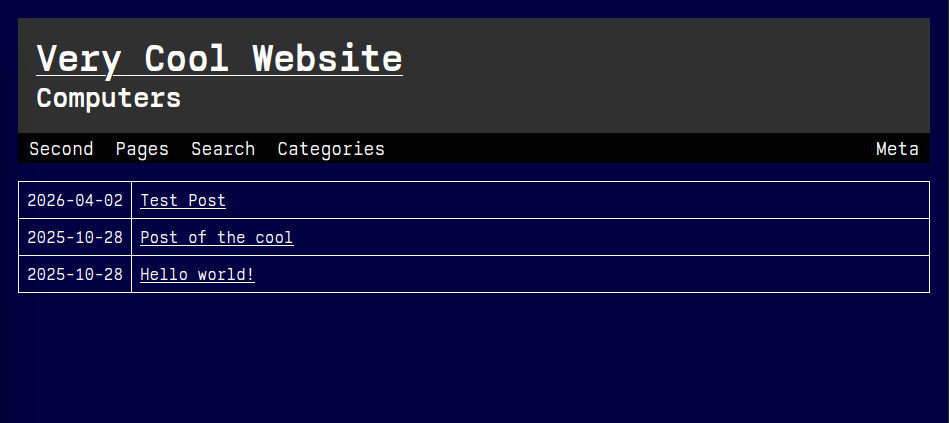

lateterm is a quick Classic WordPress theme inspired by IBM PC / MS-DOS aesthetics.

It is mainly designed for personal blogs.

Supports some customizable items.

If a primary menu is selected, it's displayed as the first menu item. Otherwise, hidden.

Installation: Drop content of `wp-content/*` into `wp-content/themes/lateterm`.

PRs are welcome.

